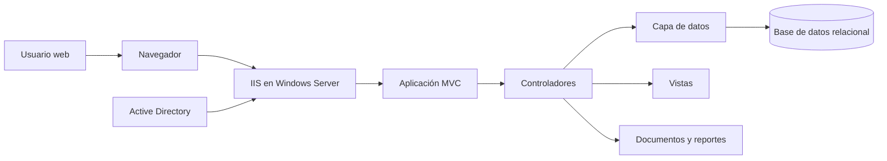
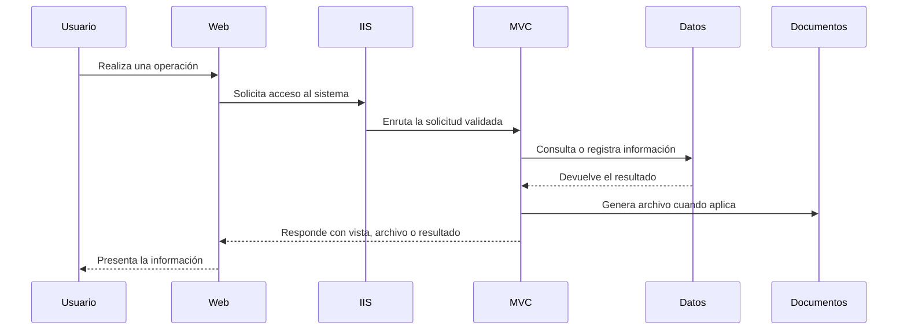

# Arquitectura

TotisGdB está construido como una aplicación web ASP.NET Core MVC. La solución separa responsabilidades entre controladores, modelos, vistas, utilidades y capa de datos, manteniendo una estructura familiar para aplicaciones empresariales basadas en .NET.

## Vista general

## Capas principales

- **Interfaz web:** Vistas MVC, componentes compartidos de navegación y recursos estáticos.
- **Hospedaje:** La publicación en producción se realiza sobre IIS en un servidor Windows.
- **Identidad corporativa:** El inicio de sesión se integra con Active Directory para aprovechar las credenciales del perfil corporativo de cada usuario.
- **Controladores:** Coordinan flujos de usuario, validan solicitudes, aplican reglas de acceso y preparan respuestas.
- **Modelos:** Representan usuarios, activos, solicitudes y registros de movimiento.
- **Capa de datos:** Usa Entity Framework Core para interactuar con la base de datos relacional.
- **Utilidades:** Concentran apoyo transversal, como envío de correos y generación de identificadores seguros de aprobación.
- **Documentos y reportes:** Integran librerías para exportación, generación de PDF, archivos de oficina y reportes paginados.

## Flujo técnico general

## Persistencia

La persistencia se apoya en una base de datos relacional administrada mediante Entity Framework Core. Las entidades principales cubren usuarios, activos fijos contables, solicitudes y trazabilidad de operaciones.

## Criterio de separación

La documentación pública evita publicar nombres internos de infraestructura, configuraciones reales, cadenas de acceso, migraciones o cualquier detalle que permita reconstruir el entorno privado.
