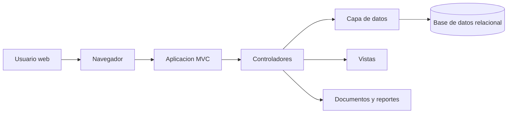
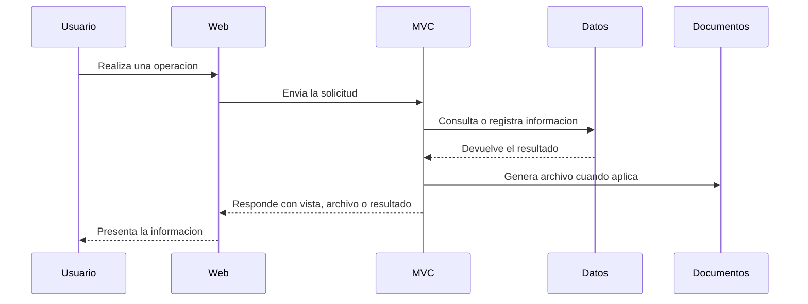

# Arquitectura

TotisGdB esta construido como una aplicacion web ASP.NET Core MVC. La solucion separa responsabilidades entre controladores, modelos, vistas, utilidades y capa de datos, manteniendo una estructura familiar para aplicaciones empresariales basadas en .NET.

## Vista general

## Capas principales

- **Interfaz web:** vistas MVC, componentes compartidos de navegacion y recursos estaticos.
- **Controladores:** coordinan flujos de usuario, validan solicitudes, aplican reglas de acceso y preparan respuestas.
- **Modelos:** representan usuarios, activos, solicitudes y registros de movimiento.
- **Capa de datos:** usa Entity Framework Core para interactuar con la base de datos relacional.
- **Utilidades:** concentran apoyo transversal, como envio de correos y generacion de identificadores seguros de aprobacion.
- **Documentos y reportes:** integran librerias para exportacion, generacion de PDF, archivos de oficina y reportes paginados.

## Flujo tecnico general

## Persistencia

La persistencia se apoya en una base de datos relacional administrada mediante Entity Framework Core. Las entidades principales cubren usuarios, activos fijos contables, solicitudes y trazabilidad de operaciones.

## Criterio de separacion

La documentacion publica evita publicar nombres internos de infraestructura, configuraciones reales, cadenas de acceso, migraciones o cualquier detalle que permita reconstruir el entorno privado.
