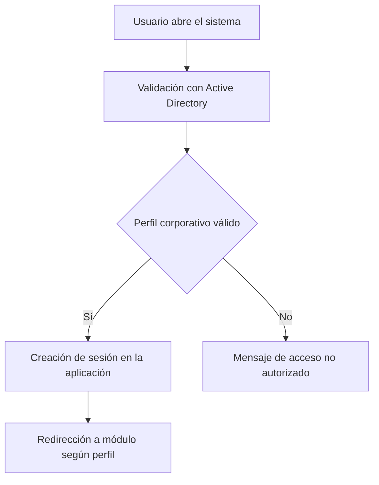
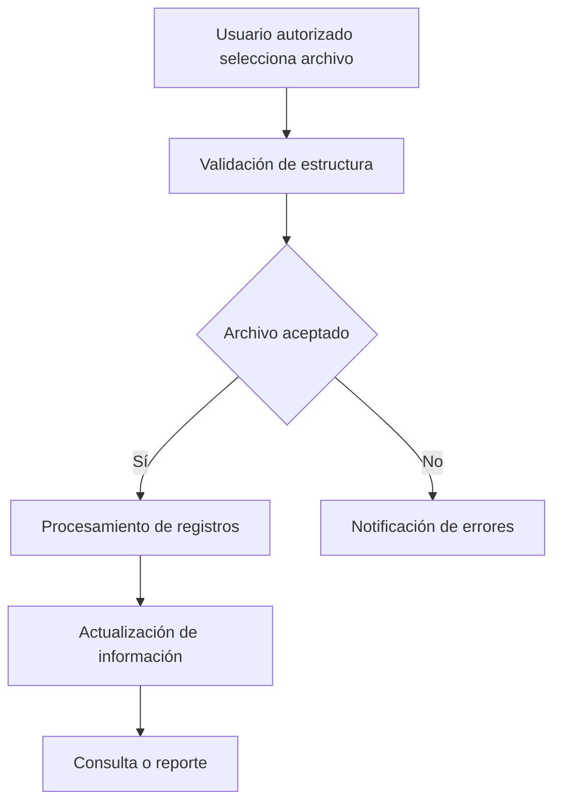

# Flujos Principales

Esta sección resume los procesos principales cubiertos por TotisGdB. Los diagramas muestran el comportamiento general sin exponer reglas internas ni detalles sensibles.

## Inicio de sesión

El sistema utiliza Active Directory para validar automáticamente al usuario con las credenciales de su perfil corporativo en Windows. Después de esa validación, la aplicación mantiene su sesión web y aplica los permisos funcionales correspondientes.

## Carga de activos desde hoja de cálculo

Este flujo permite alimentar información operativa de activos desde archivos tabulares, manteniendo validaciones previas antes de actualizar datos.

## Asignación de activos

La asignación vincula activos con responsables y puede generar documentos de respaldo para control administrativo.

## Traspaso, baja y devolución

Estos procesos comparten una estructura general: solicitud, revisión, decisión, actualización del estado del activo y registro en historial.

## Reportes y documentos

Los reportes permiten consultar información filtrada y exportar resultados para seguimiento administrativo. Los documentos generados respaldan procesos como cartas responsivas y evidencias de movimiento.
