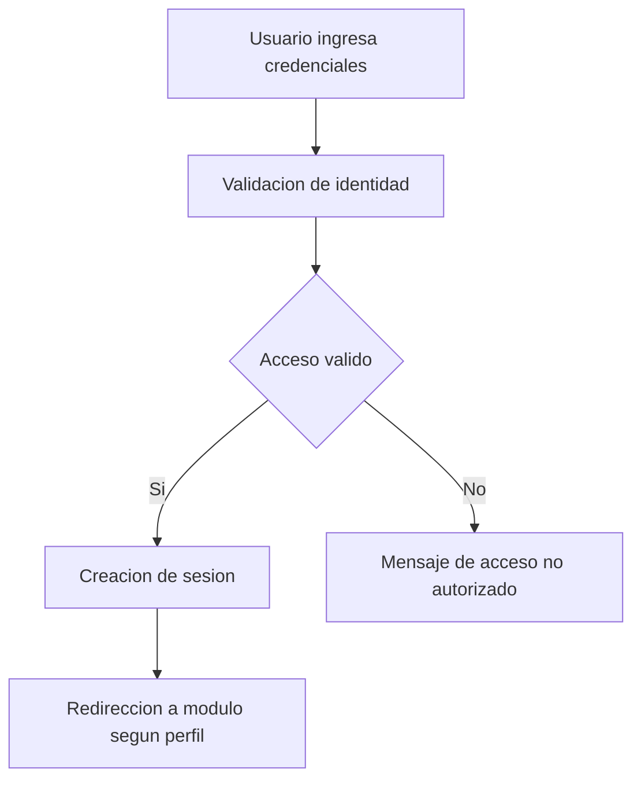
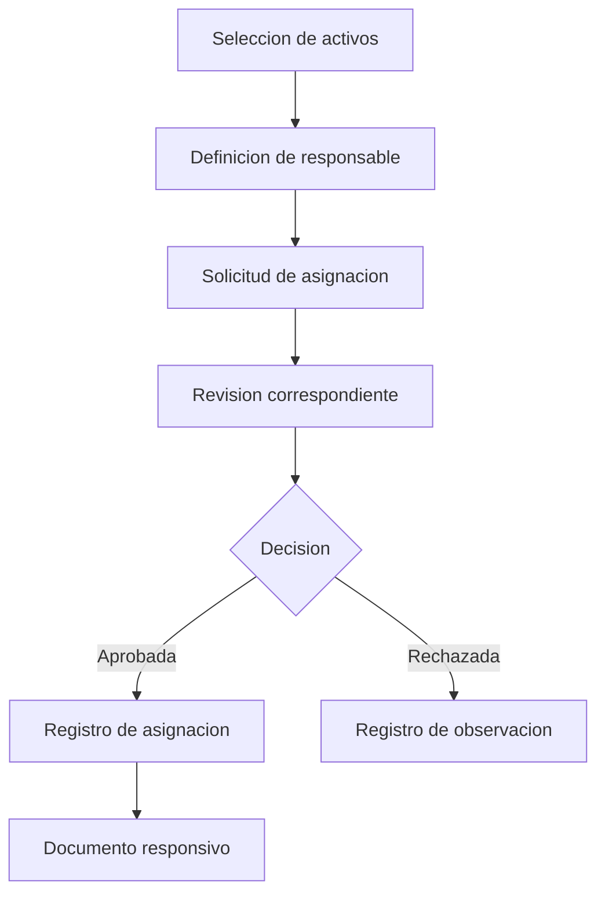
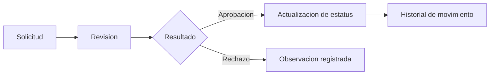

# Flujos Principales

Esta seccion resume los procesos principales cubiertos por TotisGdB. Los diagramas muestran el comportamiento general sin exponer reglas internas ni detalles sensibles.

## Inicio de sesion

El sistema utiliza autenticacion por cookies y sesiones con expiracion. Cada perfil accede a funciones acordes con sus responsabilidades.

## Carga de activos desde hoja de calculo

Este flujo permite alimentar informacion operativa de activos desde archivos tabulares, manteniendo validaciones previas antes de actualizar datos.

## Asignacion de activos

La asignacion vincula activos con responsables y puede generar documentos de respaldo para control administrativo.

## Traspaso, baja y devolucion

Estos procesos comparten una estructura general: solicitud, revision, decision, actualizacion del estado del activo y registro en historial.

## Reportes y documentos

Los reportes permiten consultar informacion filtrada y exportar resultados para seguimiento administrativo. Los documentos generados respaldan procesos como cartas responsivas y evidencias de movimiento.
